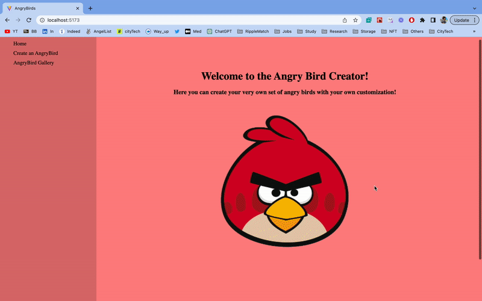

# Web Development Project 7 - *AngryBirds*

Submitted by: **Prashant Sah**

This web app: **This project does the crud operation with Supabase as a DBMS**

Time spent: **20** hours spent in total

## Required Features

The following **required** functionality is completed:

- [x] **A create form allows users to add new angrybird**
- [x] **Users can name the angrybird and set the angrybird's attributes by clicking on one of several values**
- [x] **The site displays a summary page of all the user's added angrybird**
- [x] **A previously created angrybird can be updated and deleted from the angrybird list**
- [x] **Each angrybird has a direct, unique link to an info page about them**

The following **optional** features are implemented:

- [x] The site displays summary statistics about a user's on their Gallery page

## GIF Walkthrough

## Notes

The challenging part was to do the nesting routing and with some online research i was able to do it.

## License

    Copyright [2023] [prashant sah]

    Licensed under the Apache License, Version 2.0 (the "License");
    you may not use this file except in compliance with the License.
    You may obtain a copy of the License at

        http://www.apache.org/licenses/LICENSE-2.0

    Unless required by applicable law or agreed to in writing, software
    distributed under the License is distributed on an "AS IS" BASIS,
    WITHOUT WARRANTIES OR CONDITIONS OF ANY KIND, either express or implied.
    See the License for the specific language governing permissions and
    limitations under the License.